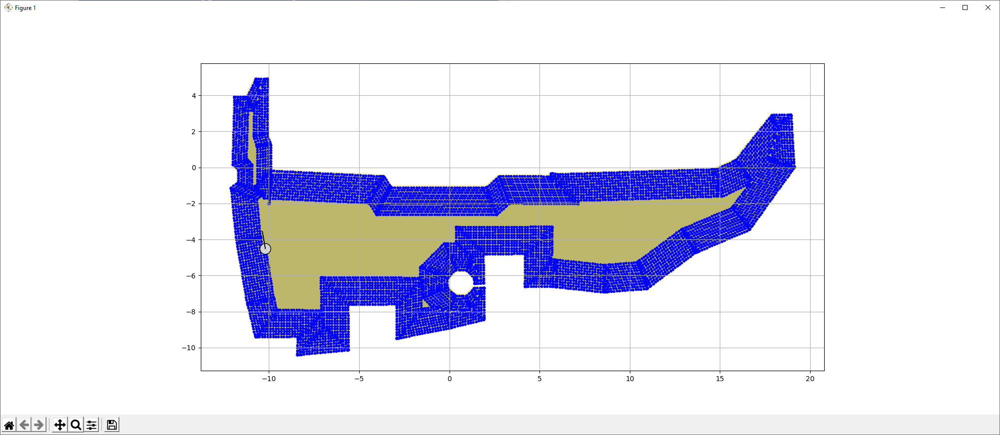

# edge-control
Control running on the Raspberry Pi hosted on the robot. It communicates with a MQTT service, subscribing to commands and publishing state.

The control is designed to run autonomic missions also when offline.

Sample simulated mission in progress of covering a garden area:

 

## Installation on Raspberry Pi

See     https://numpy.org/devdocs/user/troubleshooting-importerror.html for information on installing numpy on Raspberry Pi.
 
Preparations:

    python3 --version # minimum 3.7
    sudo python3 -m pip install -U pip

Install Poetry:
    sudo python3 -m pip install -U poetry
    curl -sSL https://raw.githubusercontent.com/python-poetry/poetry/master/get-poetry.py | python
    sudo apt install python3-venv

Dependencies not caught by Poetry:
    
    sudo apt install libgeos++  # for shapely
    sudo apt remove numpy   # 1.16!?
    sudo apt remove python3-numpy  # 1.16!?
    sudo apt install libatlas-base-dev  # numpy version 1.19
    
For the GUI:

    sudo apt install lighttpd
    # sudo apt install apache2
    sudo ln -s $HOME/gui /var/www/html
    
Copy the gui and edge-control directories over to the home directory on the RPi.

    rsync -av edge-control gui <rpi>:

Set up the configuration files.
     
    
Install dependencies and test on RPi:

    poetry install --no-root
    poetry run main
    
## Development

Install poetry (requires Python 3.10 or higher):

    python -m pip install --upgrade pip && pip install poetry

Install updated dependencies:

    poetry update
    
Run unit tests (use `-s` to show print() debug output):

    poetry run pytest -s -v

## Simulation

Run the simulator in real-time:

    poetry run mission --sim 

Medium speed simulation, run in simulated time and plot every frame: 

    poetry run mission --sim --plot

Fast simulation, run in simulated time but only plot every 150th frame: 

    poetry run mission --sim --plot --speed 150
